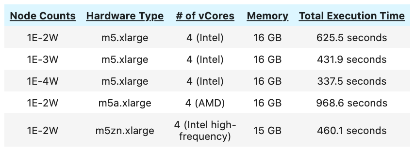

## Open Payment Data Visualization

### What is OpenPayment?

Open Payments is a national disclosure program that promotes a more transparent and accountable health care system. Open Payments houses a publicly accessible database of payments that reporting entities, including drug and medical device companies, make to covered recipients like physicians.

The data we tried to analuze and visualize here is the data gathered in the program year 2019 (January 1, 2019–December 31, 2019) and published in the year 2021. 

### Terminologies

**1. Natural of Payments**

The natural of payments is in the natrual of a severance payment considered to be reasonable by the Bank. It helps to understand the different types of payments that must be reported in the open payment. The common types of payments include,

-  Food and beverage
- Consulting fee
- Education
- Research
- Travel and lodging
- Etc.

**2. Program Participants**

There are two groups of participants in the Open Payments program. **Reporting entities** include applicable manufacturers and group purchasing organizations, or drug and medical device companies. **Covered recipients** include:

- Any physicians (with the exception of medical residents) who are not employees of the reporting entity
- Certain non-physicians
- Teaching hospitals that receive payments for Medicare direct graduate medical education (GME), inpatient prospective payment system (IPPS) indirect medical education (IME), or psychiatric hospital IME programs

### Exploratory Data Analysis (EDA)

In the program year 2019, the total US dollars involved and the total number of published records are,

 
   &nbsp;&nbsp;&nbsp;&nbsp; Total US Dollar Value &nbsp;&nbsp;&nbsp;&nbsp;&nbsp;&nbsp;&nbsp;&nbsp;&nbsp;&nbsp;&nbsp;&nbsp;&nbsp;&nbsp;&nbsp;&nbsp;&nbsp;&nbsp;&nbsp;&nbsp;&nbsp;&nbsp;&nbsp;&nbsp;&nbsp;&nbsp;&nbsp;&nbsp;&nbsp;&nbsp; Total Records Published 

 
 
  &nbsp;&nbsp;&nbsp;  $10.53 Billion &nbsp;&nbsp;&nbsp;&nbsp;&nbsp;&nbsp;&nbsp;&nbsp;&nbsp;&nbsp;&nbsp;&nbsp;&nbsp;&nbsp;&nbsp;&nbsp;&nbsp;&nbsp;&nbsp;&nbsp;&nbsp;&nbsp;&nbsp;&nbsp;&nbsp;&nbsp;&nbsp;&nbsp;&nbsp;&nbsp;&nbsp;&nbsp;&nbsp;&nbsp;&nbsp;&nbsp;&nbsp;&nbsp;&nbsp;&nbsp;&nbsp;&nbsp;&nbsp;&nbsp;&nbsp; 3.67 Million &nbsp;&nbsp;

The numbers of physicians and manufactures involved in the Program year 2019 are,

 
   &nbsp;&nbsp;&nbsp;&nbsp; Total Number of Physicians &nbsp;&nbsp;&nbsp;&nbsp;&nbsp;&nbsp;&nbsp;&nbsp;&nbsp;&nbsp;&nbsp;&nbsp;&nbsp;&nbsp;&nbsp;&nbsp;&nbsp;&nbsp; Total Number of Manufactures

 
 
  &nbsp;&nbsp;&nbsp;&nbsp;&nbsp;&nbsp;&nbsp;&nbsp;&nbsp;  623 Thousand&nbsp;&nbsp;&nbsp;&nbsp;&nbsp;&nbsp;&nbsp;&nbsp;&nbsp;&nbsp;&nbsp;&nbsp;&nbsp;&nbsp;&nbsp;&nbsp;&nbsp;&nbsp;&nbsp;&nbsp;&nbsp;&nbsp;&nbsp;&nbsp;&nbsp;&nbsp;&nbsp;&nbsp;&nbsp;&nbsp;&nbsp;&nbsp;&nbsp;&nbsp;&nbsp;&nbsp;&nbsp;&nbsp;&nbsp;&nbsp;&nbsp;&nbsp;&nbsp;&nbsp;&nbsp;&nbsp;&nbsp;&nbsp;&nbsp;&nbsp;&nbsp;&nbsp;&nbsp;&nbsp;&nbsp;&nbsp;&nbsp;1657&nbsp;&nbsp;&nbsp;&nbsp;&nbsp;&nbsp;&nbsp;&nbsp;&nbsp;&nbsp;&nbsp;&nbsp;&nbsp;&nbsp;&nbsp;&nbsp;&nbsp;

The Open Payments data has a size **5.7 GB** and we also combine it with a drug dataset of **3.1 GB**. Because of the size of the data, we use Spark Clusters for processing the data on AWS, and then made the plots by Plotly. The efficiency of using different EMR machines will be stated in the last part.

### Data Visualization

#### 1 Payment Distribution

These are figures about the distribution of payment in the Program year 2019. We made these figures to understand what is the most common amount payment. The data is very unblance as a right-skewed distribution. We split the distribution on the payment of 50 so that we can have better understanding of how the data looks like. We actually took a sample of 48,577 records from the whole set or the plot will be over large (over 113 MB). As it is displayed in the first part of distribution, we can observe that most of the payment amounts are between ​\$10 to ​\$25.


 

{{ includeGuts | replace: '    ', ''}}

Then in the second part of distribution, all we can observe is a quick decay of the counts. The data we have selected in this plot are the payments from \$50 to \$2,000.  Although there are also some payments larger than \$2,000 but they rarely happen with a porportion of around 2.8% across the whole set. So we finally decided not to include them in the visualization.


 

{{ includeGuts | replace: '    ', ''}}

#### 2 How many recipient records each state?

Next, let's take a look at which states are active in the Open Payment Program. This figure basically shows how many recipient records gathered in each state in the Program year 2019. The result shows that California, Texas, Florida, and New York are pretty active in these records. This probably because these states has a higher population. We will analyze that more in the figure 4.


 

{{ includeGuts | replace: '    ', ''}}

#### 3 How much money in total for each state by manufactures?

Now that we know some states receive more moneys than the others, so what about the manufactures? In the present figure, it shows that the applicable manufacturers, group purchasing organizations, or drug and medical device companies in California, Illinois, Indiana, Massachusetts, and New Jersey have a higher amount of payments than the other states.


 

{{ includeGuts | replace: '    ', ''}}

#### 4 Recipient Payment Records per Capita per State

Let's continue with the figure 2. In the figure 2, we can observe that some states has more records than the others. But does that mean these states are more active in this program? Probably not, we have guessed that it is probably because of the population. The present plot is the amount of money regularized by the population in each state and now we can find out that most of the states are on the same page. Massachusetts is actually an outlier in this visualization and we guess this is because it has more medical institutions than the other states.


 

{{ includeGuts | replace: '    ', ''}}

#### 5 Payment Received by Physician Specialty

To continue with our discussion, we can also have a look at the top five types of physicians that get the most of the payments. It turns out that orthopaedic surgery, neurology, and internal medicine physicians got the most payments in the Program Year 2019.


 

{{ includeGuts | replace: '    ', ''}}

#### 6 Natural of Payments by Records

We have discussed the meaning of natural of payments, and now let's discuss what is the most common natural of payments. From this figure below, we are able to observe that the most common type of payments is food and beverage about 87%. Some other top ranked natural of payments are travel and lodging, compensation, education, and etc.


 

{{ includeGuts | replace: '    ', ''}}

#### 7 Natural of Payment by Amount of Money

Instead of just viewing the number of the records for each natural of payment, we would also like to know which one contribute to the largest amount of money. The present figure shows that Royalty or License payment counts the most of the payments about 1.58 billion even if they does not rank high on the number of records. 


 

{{ includeGuts | replace: '    ', ''}}

#### 8 Drug Cost and Payment Received Relationship

So the final question is that: what is the impact of the these payments? We combined the Open Payment dataset in 2019 with the drug cost dataset in 2019 together and then made the following scatter plot. The result shows that we are expected to see a higher drug cost if the current state has a higher amount of payment received. 


 

{{ includeGuts | replace: '    ', ''}}

### EMR Performance

The present plots and analysis are made based on AWS EMR, Apache Spark, and Plotly. We have test these Spark operations out on different EMR clusters to see the difference in their performance. The result shows that we can add more workers to have better performance. Besides, the Intel's chip (m5.xlarge based on Intel Xeon Platinum 8000) has a better performance on the AMD's chip in the same level (m5a.xlarge based on AMD EPYC 7000). What's more, it also shows that the chip with higher frequency (m5zn.xlarge based on Intel Xeon Scalable processors with a frequency up to 4.5 GHz) has a higher performance even when we have sightly smaller memories of 15GB and less works than the ordinary Intel chips.

 *Note*: In the first column, **E** means the number of executors and **W** means the number of workers.